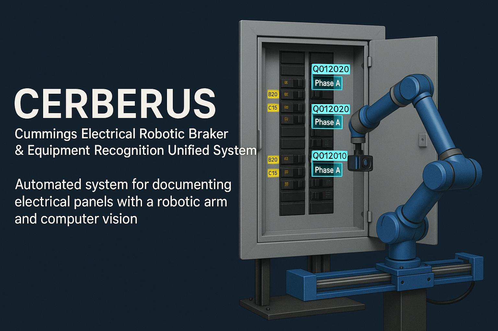

<div align="center">



# CERBERUS

**Cummings Electrical Robotic Breaker & Equipment Recognition Unified System**

> Automated robotic system for documenting electrical panels using computer vision and multi-model AI

[](#)
[](#)
[](#)
[](#)

</div>

---

## Problem Statement

Documenting electrical panels during service calls or new installations is time-consuming, error-prone, and requires trained technicians to manually identify and record breaker information. This process can take hours for large commercial panels with dozens of breakers.

**CERBERUS automates this workflow** by combining robotic positioning, high-resolution imaging, and AI-powered recognition to capture complete panel documentation in minutes.

---

## High-Level Architecture

```
┌─────────────────────────────────────────────────────────────────┐
│                        CERBERUS System                          │
├─────────────────────────────────────────────────────────────────┤
│                                                                 │
│  ┌──────────────┐    ┌──────────────┐    ┌──────────────┐      │
│  │   Robot Arm  │    │    Gantry    │    │   Cameras    │      │
│  │   (6-DOF)    │◄──►│   (Linear)   │◄──►│  (Hi-Res)    │      │
│  └──────────────┘    └──────────────┘    └──────────────┘      │
│          │                  │                   │               │
│          └──────────────────┼───────────────────┘               │
│                             ▼                                   │
│                    ┌──────────────┐                             │
│                    │  Vision AI   │                             │
│                    │ (YOLO + OCR) │                             │
│                    └──────────────┘                             │
│                             │                                   │
│          ┌──────────────────┼──────────────────┐               │
│          ▼                  ▼                  ▼               │
│  ┌──────────────┐  ┌──────────────┐  ┌──────────────┐         │
│  │  Local LLM   │  │   Cloud AI   │  │    Backup    │         │
│  │  (Primary)   │  │  (Fallback)  │  │   Provider   │         │
│  └──────────────┘  └──────────────┘  └──────────────┘         │
│                                                                 │
└─────────────────────────────────────────────────────────────────┘
```

The system operates in three stages:
1. **Capture** — Robotic arm positions camera across panel surface via linear gantry
2. **Detect** — YOLO models identify panels, breakers, and text regions
3. **Recognize** — OCR extracts part numbers, validated by multi-model AI pipeline

---

## Tech Stack

| Component | Technology | Purpose |
|-----------|------------|---------|
| **ML Framework** | PyTorch + Ultralytics | YOLO model training and inference |
| **Object Detection** | YOLOv8 (custom trained) | Panel and breaker localization |
| **OCR** | PaddleOCR | Text extraction from breaker labels |
| **Robot Control** | LeRobot (HuggingFace) | 6-DOF arm motion planning |
| **Edge Processing** | Raspberry Pi | On-site capture and preprocessing |
| **PLC** | Arduino-compatible | Gantry motor control |
| **AI Backend** | Local LLM + Cloud APIs | Part number validation |

---

## Core Features

### 🤖 Robotic Capture System
- **6-DOF robotic arm** for precise camera positioning
- **Linear gantry** (650mm stroke) for horizontal panel scanning
- **Multi-waypoint motion paths** with safety interlocks
- **Automatic torque management** and emergency stop capability

### 🎯 Computer Vision Pipeline
- **Custom YOLO models** trained for 15+ detection classes
- **Polygon annotation tool** for training data creation
- **Local CUDA training** with automatic GPU optimization
- **Google Colab integration** for cloud-based training

### 🔍 AI-Powered Recognition
- **Multi-model inference** with local-first, cloud-fallback strategy
- **OCR confidence scoring** for reliable text extraction
- **Part number validation** against known breaker databases
- **Phase detection** for multi-pole breakers

### 📡 Edge Deployment
- **Raspberry Pi integration** for portable on-site use
- **Cloud synchronization** for centralized data storage
- **Offline capability** with local inference

---

## Detection Classes

The YOLO model is trained to recognize:

| Category | Classes |
|----------|---------|
| **Structural** | Panel boundary, panel label |
| **Components** | Breaker face, text region |
| **Manufacturers** | Various breaker types (ELB, LS, Schneider, etc.) |

---

## Project Structure

```
cerberus/
├── yolo_training/           # Model training pipeline
│   ├── configs/             # Training configurations
│   ├── tools/               # Annotation utilities
│   └── colab/               # Cloud training notebooks
├── robot_control/           # Robotic arm framework
├── vision_model/            # Inference and runtime
├── services/                # Background daemons
├── edge_pipeline/           # Raspberry Pi components
├── plc_firmware/            # Gantry controller code
└── tools/                   # Diagnostics & utilities
```

---

## Current Status

**🔄 Active Development**

- ✅ Robotic arm integration complete
- ✅ Custom YOLO training pipeline operational
- ✅ Multi-model AI inference working
- 🔄 Edge deployment optimization in progress
- 📋 Production packaging planned


## Business Value

| Metric | Before | After |
|--------|--------|-------|
| **Panel documentation time** | 2-4 hours | 15-30 minutes |
| **Data entry errors** | 5-10% | <1% |
| **Technician skill required** | Senior | Any trained operator |
| **Documentation completeness** | Variable | 100% captured |

---

## Acknowledgments

- [LeRobot](https://github.com/huggingface/lerobot) by HuggingFace — Robot control framework
- [Ultralytics YOLOv8](https://github.com/ultralytics/ultralytics) — Object detection
- [PaddleOCR](https://github.com/PaddlePaddle/PaddleOCR) — Text recognition

---

<div align="center">

**Robotic Automation • Computer Vision • Edge AI**

</div>

