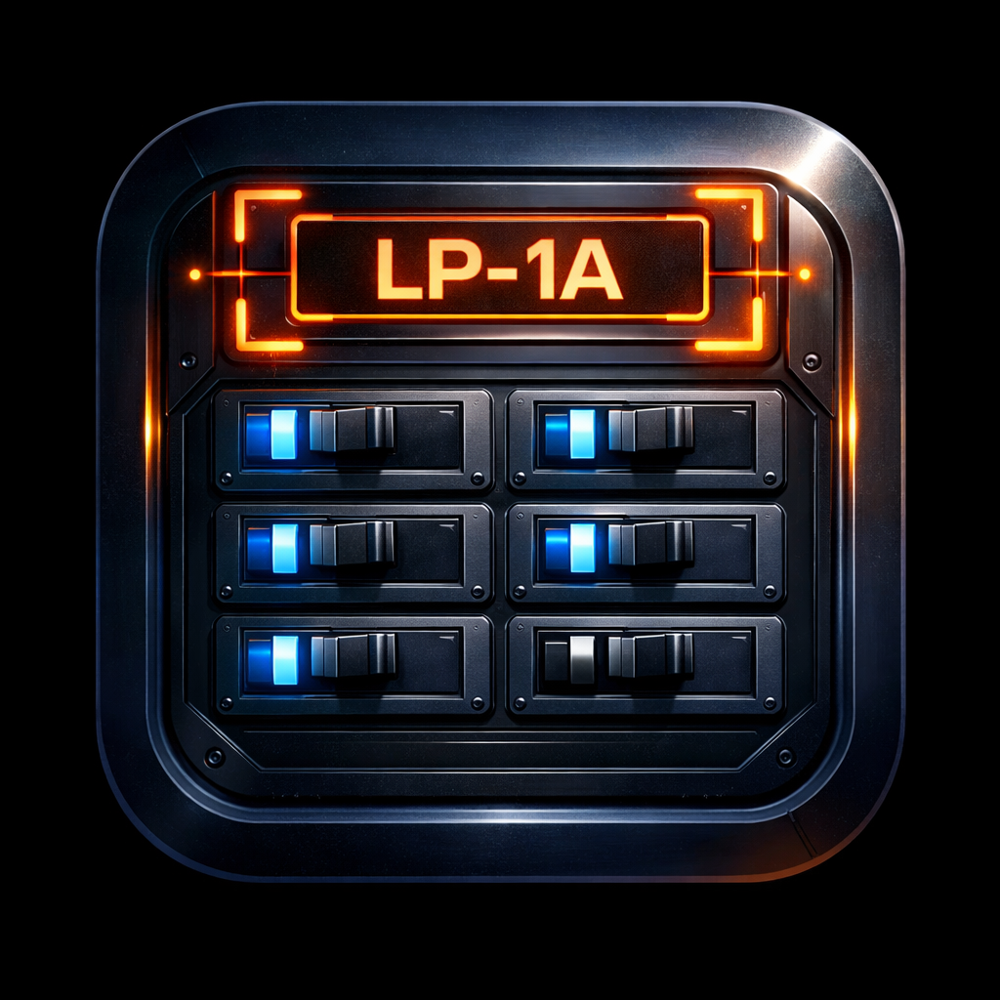

<div align="center">



# Project Recorder

**Job Site Video Recorder with Panel Label Detection & OCR**

> iOS app for recording video with automatic electrical panel label detection, OCR scanning, AI verification, and OneDrive upload

[](#)
[](#)
[](#)
[](#)

</div>

---

## Problem Statement

Electrical contractors record job site walkthrough videos for documentation, but naming and organizing these files is a manual headache. Technicians must remember panel identifiers, manually rename recordings, and upload them to shared storage—leading to mislabeled files, inconsistent naming, and hours of post-job admin work.

**Project Recorder automates the entire capture-to-upload pipeline** by detecting panel labels in the camera feed, reading them with OCR, and using the scanned label as the video filename—with optional AI verification and direct OneDrive upload.

---

## High-Level Architecture

```
┌─────────────────────────────────────────────────────────────────┐
│                      Project Recorder                            │
├─────────────────────────────────────────────────────────────────┤
│                                                                  │
│  ┌─────────────┐    ┌─────────────┐    ┌─────────────┐          │
│  │   Camera    │───►│   YOLO      │───►│   Vision    │          │
│  │   Feed      │    │   CoreML    │    │   OCR       │          │
│  └─────────────┘    └─────────────┘    └─────────────┘          │
│         │                  │                  │                   │
│         ▼                  ▼                  ▼                   │
│  ┌─────────────────────────────────────────────────────┐         │
│  │              Tap-to-Scan Pipeline                    │         │
│  │    Detection → Tap Box → Crop → OCR → Verify        │         │
│  └─────────────────────────────────────────────────────┘         │
│                           │                                      │
│         ┌─────────────────┼─────────────────┐                   │
│         ▼                 ▼                 ▼                   │
│  ┌─────────────┐   ┌─────────────┐   ┌─────────────┐          │
│  │  AI Verify  │   │  Smart Name │   │  OneDrive   │          │
│  │  Grok xAI   │   │  Auto-File  │   │  Upload     │          │
│  └─────────────┘   └─────────────┘   └─────────────┘          │
│                                                                  │
└─────────────────────────────────────────────────────────────────┘
```

The workflow:
1. **Detect** — YOLO CoreML model identifies panel label stickers in the live camera feed
2. **Scan** — Tap a bounding box to crop and OCR the label text
3. **Verify** — Optionally validate with xAI Grok vision model for higher accuracy
4. **Name** — Confirmed label becomes the video filename (e.g. `200038_SDC_MECHANICAL#1_20260218.mp4`)
5. **Upload** — Auto-upload to a configurable OneDrive folder

---

## Tech Stack

| Component | Technology | Purpose |
|-----------|------------|---------|
| **Framework** | SwiftUI | Modern iOS UI |
| **ML Inference** | CoreML + YOLO | Real-time panel label detection |
| **OCR** | Apple Vision | On-device text extraction |
| **AI Verification** | xAI Grok (optional) | Vision model reads label from cropped image |
| **Recording** | AVFoundation | Video capture with duration timer |
| **Cloud Storage** | OneDrive (Microsoft Graph) | OAuth + auto-upload to configurable folder |
| **Auth** | Microsoft OAuth 2.0 | Azure App Registration for OneDrive access |

---

## Core Features

### 🎯 Panel Label Detection
- YOLO-based real-time detection of electrical panel label stickers
- Bounding box overlays on the live camera preview
- Persistent tracking with NMS (non-maximum suppression)

### 📝 Tap-to-Scan OCR
- Tap any detected bounding box to capture and read the label
- Apple Vision OCR supports multi-line labels (e.g. `200038-SDC MECHANICAL #1`)
- User confirmation step before applying the scanned label

### 🤖 AI Verification
- Optional xAI Grok vision model reads the label directly from the cropped image
- Catches OCR misreads for higher accuracy on damaged or low-contrast labels
- Configurable API key in Settings

### 📁 Smart File Naming
- Scanned labels are sanitized into filenames automatically
- `200038-SDC MECHANICAL #1` → `200038_SDC_MECHANICAL#1_20260218_143025.mp4`
- Timestamps prevent collisions

### ☁️ OneDrive Auto-Upload
- Microsoft OAuth authentication flow
- Configurable upload destination folder
- Background upload after recording completes

### 🎥 Recording Controls
- Standard video recording with duration timer
- Save confirmation toast feedback
- Built-in library browser for playback and management

---

## App Structure

```
Project_Recorder/
├── Models/
│   ├── Detection.swift          # Detection, OCRResult, TrackState models
│   └── VideoStore.swift         # Video library persistence
├── Services/
│   ├── CameraManager.swift      # AVFoundation camera + recording
│   ├── DetectionService.swift   # YOLO CoreML inference
│   ├── OCRService.swift         # Vision OCR + Grok API integration
│   ├── OneDriveManager.swift    # OAuth + OneDrive upload
│   └── PanelTracker.swift       # Detection tracking, NMS, tap-to-capture
├── Views/
│   ├── RecorderView.swift       # Main camera/recording view
│   ├── DetectionOverlayView.swift # Bounding box overlay
│   ├── OCRConfirmationOverlay.swift # OCR result confirm/verify UI
│   ├── SettingsView.swift       # OneDrive, OCR, Grok settings
│   └── LibraryView.swift        # Video library browser
├── CameraPreview.swift          # AVCaptureVideoPreviewLayer wrapper
└── ContentView.swift            # Tab bar root
```

---

## Current Status

**🔄 Active Development**

- ✅ YOLO CoreML real-time label detection
- ✅ Tap-to-scan OCR pipeline working
- ✅ Grok AI verification integrated
- ✅ Smart file naming from scanned labels
- ✅ OneDrive OAuth + auto-upload
- ✅ Video library with playback
- 🔄 Multi-label scanning in progress
- 📋 Batch upload queue planned

## Business Value

| Metric | Impact |
|--------|--------|
| **File naming** | Automatic from scanned label — no manual entry |
| **Upload workflow** | Direct to OneDrive — no cable transfer |
| **OCR accuracy** | AI verification catches misreads |
| **Time savings** | Eliminates post-job file renaming and organizing |
| **Hardware cost** | Uses existing iPhones |

---

## Device Requirements

| Requirement | Specification |
|-------------|---------------|
| **Device** | iPhone 11 or newer |
| **iOS** | 17.0+ |
| **Storage** | ~150MB for app + model |
| **Network** | Required for OneDrive upload and AI verification |

---

<div align="center">

**On-Device ML • OCR • AI Verification • Cloud Upload**

*Built with Swift • Powered by CoreML & Vision • Made for Job Sites*

</div>
