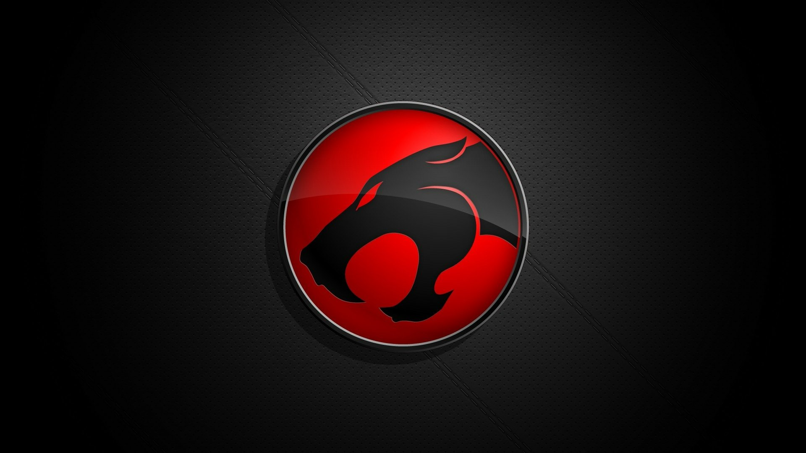

# Integrated Manufacturing Projects

<div align="center">

**A portfolio showcasing internal software engineering projects for industrial automation, computer vision, and mobile tooling.**

<br/>

[](Projects/)
[](https://python.org)
[](https://swift.org)
[](LICENSE)

<br/>


</div>

---

## What Is This Repository?

This is a **public-facing portfolio** that showcases multiple internal software projects I've built and maintain. The actual source code lives in private repositories—this repo serves as a curated presentation of:

- **What each project does** and why it matters
- **Technical architecture** and tooling decisions
- **My contributions** as the primary developer
- **Business value** delivered to the organization

> 💡 This portfolio is designed to be readable by both technical reviewers and non-technical leadership.

---

## Project Showcase

<table>
<tr>
<td width="50%" align="center">

<a href="Projects/CERBERUS/">

</a>

**[CERBERUS](Projects/CERBERUS/)**<br/>
*Robotic Panel Documentation*


</td>
<td width="50%" align="center">

<a href="Projects/Cummings_CV/">

</a>

**[Cummings CV](Projects/Cummings_CV/)**<br/>
*Industrial Video Analytics*


</td>
</tr>
<tr>
<td width="50%" align="center">

<a href="Projects/ORION/">

</a>

**[ORION](Projects/ORION/)**<br/>
*Multi-Camera AI Platform*


</td>
<td width="50%" align="center">

<a href="Projects/Panel_Scanner_IOS/">

</a>

**[Panel Scanner iOS](Projects/Panel_Scanner_IOS/)**<br/>
*Mobile Panel Detection App*


</td>
</tr>
</table>

---

## Project Summaries

### 🤖 CERBERUS
**Cummings Electrical Robotic Breaker & Equipment Recognition Unified System**

An automated robotic system that captures high-resolution images of electrical panels using a 6-DOF robotic arm and linear gantry, then applies YOLO object detection and OCR to identify breaker part numbers and phases. Features a multi-model AI pipeline with local LLM inference and cloud fallback. Computer vision model training pipelines help expedite inference systems to match exact needs for vision processing.

**Key Outcomes:**
- Eliminates manual image documentation and annotation (hours → minutes)
- Custom YOLO models trained for 15+ breaker classes, trainable for any CV task
- Edge processing via Raspberry Pi for on-site deployments

📁 [View Project Details →](Projects/CERBERUS/)

---

### 📹 Cummings CV
**Enterprise Computer Vision for Industrial Safety & Monitoring**

A production-grade video analytics platform integrating with multi-channel NVR systems for real-time AI inference. Supports person detection, instance segmentation, pose estimation, and persistent object tracking across 8 simultaneous camera feeds.

**Key Outcomes:**
- 8-channel live monitoring with privacy-preserving anonymization
- YOLOv11-Large with 27.6M parameters for high-accuracy detection
- Web-based dashboard with real-time streaming and analysis queuing

📁 [View Project Details →](Projects/Cummings_CV/)

---

### 🛰️ ORION
**Operational Recognition Intelligence and Observation Network**

A next-generation AI vision platform combining edge computing (Raspberry Pi + Hailo AI accelerator) with centralized backend processing for safety monitoring, cross-camera personnel tracking, and workflow analytics at scale.

**Key Outcomes:**
- Hybrid edge/cloud architecture for optimal latency and throughput
- Cross-camera tracking with persistent ID assignment
- Real-time TV dashboard output via HDMI from edge device

📁 [View Project Details →](Projects/ORION/)

---

### 📱 Panel Scanner iOS
**Mobile Electrical Panel Detection & Inventory App**

A professional iOS application for electrical contractors featuring 30 FPS on-device ML inference, AR visualization mode, and smart OCR for panel identification. Exports synchronized video recordings with structured JSON/CSV data.

**Key Outcomes:**
- YOLOv8-Large CoreML model running entirely on-device
- AR mode with floating 3D labels for hands-free inspection
- Complete panel inventory captured in minutes, not hours

📁 [View Project Details →](Projects/Panel_Scanner_IOS/)

---

## Technical Highlights

### Computer Vision & Machine Learning
- Custom YOLO models (v8, v11) trained for domain-specific detection classes
- On-device inference using CoreML (iOS) and Hailo AI accelerator (Raspberry Pi)
- Multi-object tracking with ByteTrack for persistent ID assignment
- Instance segmentation for privacy-preserving person anonymization

### Edge AI & Embedded Systems
- Raspberry Pi 5 deployments with dedicated AI accelerators (26 TOPS)
- Real-time inference at 10-30 FPS depending on model complexity
- Hybrid processing: edge inference + centralized heavy compute
- Industrial hardware integration (PLCs, robotic arms, motorized gantries)

### iOS & Mobile Development
- SwiftUI + Combine for reactive, modern iOS architecture
- CoreML integration with Neural Engine optimization
- ARKit for augmented reality overlay visualization
- Enterprise SSO integration (Microsoft Entra ID / Okta)

### Backend & Infrastructure
- FastAPI / Flask REST APIs with PostgreSQL persistence
- Docker containerization for reproducible deployments
- Redis-backed task queues with Celery workers
- Multi-camera RTSP/HTTP streaming with adaptive throttling

### Robotics & Automation
- 6-DOF robotic arm control via serial protocols
- Linear gantry systems with PLC communication
- Multi-waypoint motion planning with safety interlocks
- Custom annotation and training pipelines for object detection

---

## Repository Structure

```
├── README.md                 ← You are here
├── projects.json             ← Structured project manifest
├── Projects/
│   ├── CERBERUS/             ← Robotic panel documentation
│   ├── Cummings_CV/          ← Industrial computer vision
│   ├── ORION/                ← Multi-camera AI platform
│   └── Panel_Scanner_IOS/    ← iOS panel scanner app
├── Meta/
│   └── how-to-update.md      ← Maintenance instructions
└── Scripts/
    └── print_projects.py     ← Project summary utility
```

---

## My Role & Contributions

As the **sole developer** on these projects, I am responsible for:

- **Architecture & Design** — System design, technology selection, data modeling
- **Implementation** — Full-stack development across Python, Swift, embedded systems
- **ML/AI Pipeline** — Data collection, annotation, model training, deployment
- **Hardware Integration** — Robotics, PLCs, cameras, AI accelerators
- **DevOps** — Docker, CI/CD, deployment automation
- **Documentation** — Technical docs, user guides, training materials

---

## Contact

For questions about these projects or collaboration opportunities:

**Jacob Yount**  
*R&D Engineer — Industrial Automation & AI*

---

<div align="center">

**Industrial AI • Computer Vision • Mobile Development • Robotics**

*Building intelligent systems for manufacturing and electrical industries*

<br/>


</div>

